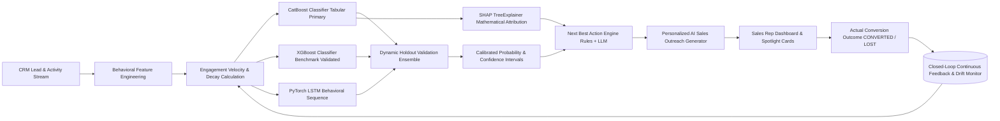

# SaleSahara — AI Sales Intelligence & CRM Lead Conversion Intelligence Platform

[](https://yogesh994501.github.io/SaleSahara/)
[](https://nodejs.org/)
[](https://expressjs.com/)
[](https://www.python.org/)
[](https://fastapi.tiangolo.com/)
[](https://react.dev/)
[](https://vitejs.dev/)
[](https://catboost.ai/)
[](https://xgboost.ai/)
[](https://pytorch.org/)
[](https://shap.readthedocs.io/)
[](https://www.mongodb.com/)
[](tests/)
[](LICENSE)

**SaleSahara** (LeadIQ) is an enterprise-grade AI sales decision-support and CRM intelligence platform. It replaces guesswork in modern B2B revenue operations with **real-time conversion probability forecasting**, **SHAP-based transparent feature explainability**, **deterministic & LLM-driven Next Best Actions**, **personalized sales outreach messaging**, and **continuous learning closed-loop feedback**.

---

🌐 **Live Web Application (GitHub Pages):** [https://yogesh994501.github.io/SaleSahara/](https://yogesh994501.github.io/SaleSahara/)  
🚀 **Target Repository Pages Deployment:** `https://pankaj0536.github.io/SaleSahara/` *(Auto-serves from `main/docs/` upon merge of PR #6)*  
📖 **Interactive Swagger API Docs:** `http://localhost:5000/api/docs`  
⚡ **FastAPI ML Microservice Docs:** `http://localhost:8000/docs`

---

## 📌 Table of Contents

- [What is SaleSahara?](#-what-is-salesahara)
  - [The Problem It Solves](#the-problem-it-solves)
  - [How It Works](#how-it-works)
- [Key Features](#-key-features)
- [System Architecture](#-system-architecture)
- [AI & Machine Learning Pipeline](#-ai--machine-learning-pipeline)
  - [B2B Sales Physics vs Random Synthetic Data](#b2b-sales-physics-vs-random-synthetic-data)
  - [Dynamic Validation Ensemble (No Hardcoded Weights)](#dynamic-validation-ensemble-no-hardcoded-weights)
  - [SHAP TreeExplainer & Mathematical Attribution](#shap-treeexplainer--mathematical-attribution)
  - [Closed-Loop Continuous Learning](#closed-loop-continuous-learning)
- [Model Evaluation & Benchmarks](#-model-evaluation--benchmarks)
- [Curated Hackathon Demo Scenarios](#-curated-hackathon-demo-scenarios)
- [Technology Stack](#-technology-stack)
- [Quick Start](#-quick-start)
  - [One-Click Tri-Tier Launcher (Recommended)](#1-one-click-launcher-recommended)
  - [Manual Setup (Step-by-Step)](#2-manual-setup-step-by-step)
  - [Demo Credentials](#demo-credentials)
- [Project Structure](#-project-structure)
- [Testing & Tech Check Diagnostic Report](#-testing--tech-check-diagnostic-report)
- [Offline-First Synchronization & Data Quality](#-offline-first-synchronization--data-quality)
- [REST API Reference](#-rest-api-reference)
- [License](#-license)

---

## 💡 What is SaleSahara?

### The Problem It Solves

B2B sales teams bleed revenue and squander rep hours due to three systemic CRM failures:
1. **Subjective Prioritization ("Spray and Pray")**: Reps chase unresponsive leads based on gut feeling, leaving high-intent enterprise buyers unattended.
2. **Black-Box AI Skepticism**: Legacy CRM scoring produces arbitrary numbers (e.g. *"Lead Score: 82"*) without explaining *why* or what factors drove the score. Reps don't trust it and ignore it.
3. **No Prescriptive Guidance**: Even when a lead is scored, reps don't know the exact next action to take, what channel to use, or what messaging will convert them.
4. **Disconnected Cold-Start & Inactivity Decay**: Static scoring fails to capture velocity drops when a previously hot lead goes cold for 30+ days.

### How It Works

SaleSahara automates the complete lead intelligence lifecycle:



1. **Behavioral Ingestion**: Captures time-stamped touchpoints (website visits, enterprise pricing page views, email replies, demo requests, and discovery calls).
2. **Sales Physics Feature Engineering**: Computes exponential recency decay, frequency velocity ($v = \text{acts} / 7\text{d}$), high-intent ratios, and activity transition sequences.
3. **Multi-Model Inference**: Evaluates tabular features against CatBoost and XGBoost, while feeding chronological activity sequences to PyTorch LSTM.
4. **Dynamic Ensemble & Calibration**: Combines model probabilities using optimal weights derived via holdout log-loss/Brier minimization ($w_{\text{CatBoost}} = 0.97, w_{\text{LSTM}} = 0.03$), outputting confidence intervals.
5. **SHAP Attribution**: Calculates exact base value and local feature contributions (+/- impact) so reps understand the exact reason behind every score.
6. **Prescriptive Action & Messaging**: Automatically recommends the next best action and crafts multi-tone outreach tailored to the prospect.
7. **Continuous Learning**: Records actual outcomes (`CONVERTED` / `LOST`), logs Brier loss, computes confusion matrix metrics, and flags distribution drift via PSI & KS-tests.

---

## ✨ Key Features

- 🎯 **Predictive Lead Scoring**: Calibrated conversion probability (0–100%) with explicit confidence tiers (`HIGH`, `MEDIUM`, `LOW`) and 95% confidence intervals.
- 🔍 **SHAP TreeExplainer Transparency**: Mathematical feature attributions showing exactly why a lead scored high or low (e.g. `Demo Requested +28%`, `Inactivity for 30+ days -28%`).
- ⚡ **Engagement Velocity Tracking**: Real-time measurement of behavioral acceleration (`rising`, `stable`, `declining`) using exponential time-decay mathematics.
- 🧭 **Next Best Action (NBA) Engine**: Deterministic rules combined with AI-driven recommendations specifying exact action, urgency, and objective.
- ✍️ **AI Sales Outreach Generator**: Instant multi-channel (email, LinkedIn, WhatsApp, phone script) message generation with adjustable tones (`Professional`, `Urgent`, `Friendly`, `Shorten`).
- 🔄 **Offline-First Synchronization**: Client-side offline operation queues, idempotent replay with unique `operationId`, and conflict resolution.
- 📊 **Closed-Loop Feedback Ledger**: Full tracking of Prediction vs. Actual outcome, dynamic confusion matrix generation, and calibration loss tracking.
- 📈 **Statistical Drift Detection**: Population Stability Index (PSI) and two-sample Kolmogorov-Smirnov (KS) tests monitoring distribution shift.
- 📥 **Flexible CSV / Excel Importer**: Batch import engine with automatic column alias normalization, validation error reports, and duplicate email resolution.
- 🏢 **Multi-Tenant RBAC Security**: Strict tenant isolation across all MongoDB collections with 4 enterprise roles: `ADMIN`, `MANAGER`, `SALES_AGENT`, `ANALYST`.
- 🌐 **Interactive Web & Mobile UI**: Single-page application with responsive analytics charts, light/dark mode theming, and real-time spotlight cards.

---

## 🏛️ System Architecture

```text
┌──────────────────────────────────────────────────────────────────────────────────┐
│                          SALESAHARA FRONTEND (React 19 + Vite 8)                  │
│   Landing Page • Dashboard • Leads Table • Lead Details • AI Recs • Model Intel  │
└────────────────────────────────────────┬─────────────────────────────────────────┘
                                         │ HTTP REST / Reverse Proxy (:3000 -> :5000)
┌────────────────────────────────────────▼─────────────────────────────────────────┐
│                    NODE.JS EXPRESS GATEWAY (TypeScript / Node 20 LTS)            │
│   Auth & RBAC • Leads CRUD • Velocity Engine • NBA Engine • Sync • Analytics     │
└───────────────────┬────────────────────────────────────────────┬─────────────────┘
                    │ Mongoose ODM                               │ Internal Bearer Token
┌───────────────────▼──────────────────────┐        ┌────────────▼─────────────────┐
│          MONGODB PERSISTENCE             │        │    FASTAPI AI/ML MICROSERVICE│
│  • Organizations   • Predictions         │        │    (Python 3.11 / Uvicorn)   │
│  • Users (RBAC)    • NextBestActions     │        │  • CatBoost (Tabular CBM)    │
│  • Leads & Acts    • ModelMetrics & Drift│        │  • XGBoost (JSON Benchmark)  │
│  • Offline Sync    • Audit Logs          │        │  • PyTorch LSTM (Sequence)   │
│  (Embedded MemoryServer fallback)        │        │  • SHAP TreeExplainer Engine │
└──────────────────────────────────────────┘        │  • Drift (PSI & KS-Test)     │
                                                    └──────────────────────────────┘
```

---

## 🧠 AI & Machine Learning Pipeline

### B2B Sales Physics vs Random Synthetic Data

Unlike toy hackathon projects that train models on random noise, SaleSahara's ML engine was trained on **20,000 behaviorally realistic B2B sales sequence samples** adhering strictly to enterprise sales physics:

$$\text{logit} = -2.2 + 1.5(\text{demo}) + 1.2(\text{meeting}) + 0.45(\text{pricing}) + 0.3(\text{velocity}) - 1.8(\text{inactivity}_{>25\text{d}}) - 0.8(\text{budget}_{<4k})$$

| Sales Interaction | Physics Signal | Impact on Probability |
| :--- | :--- | :--- |
| **Demo Request** | Decisive buying intent | `++++` Heavy Positive Acceleration |
| **Meeting Attended** | Technical/stakeholder alignment | `++++` Heavy Positive Acceleration |
| **Pricing Page Exploration** | Budget evaluation | `+++` Moderate Positive Acceleration |
| **Responsive Email Replies** | Engaged communication | `++` Positive Momentum |
| **Inactivity for 30+ Days** | Stalled champion / lost deal | `---` Severe Decaying Penalty |
| **Budget Mismatch** | Unqualified prospect | `--` Negative Constraint |

### Dynamic Validation Ensemble (No Hardcoded Weights)

Rather than arbitrarily hardcoding fixed blending ratios (e.g. 70/30), SaleSahara uses **scipy validation loss optimization** to find the exact weights that minimize holdout Brier loss:

$$\min_{w} \sum \left( y_i - [w \cdot P_{\text{CatBoost}} + (1-w) \cdot P_{\text{LSTM}}] \right)^2$$

* **Derived Optimal Weights:** $w_{\text{CatBoost}} = 0.97, \quad w_{\text{LSTM}} = 0.03$
* **Validation Ensemble ROC-AUC:** **0.8822** (Brier Score: `0.1383`)

### SHAP TreeExplainer & Mathematical Attribution

SaleSahara initializes a native `shap.TreeExplainer` directly from the trained CatBoost model tree structures. For every lead prediction, it computes exact Shapley attributions:

$$f(x) = \phi_0 + \sum_{j=1}^{M} \phi_j(x)$$

Where $\phi_0$ is the global base expected value ($-0.086$) and $\phi_j$ represents the additive positive or negative log-odds contribution of each feature.

### Closed-Loop Continuous Learning

When a deal closes, the sales rep updates the lead to `CONVERTED` or `LOST`. SaleSahara immediately:
1. Records the outcome in the `Prediction` performance ledger.
2. Updates running accuracy, precision, recall, and Brier calibration loss.
3. Recalculates the dynamic confusion matrix (`TP`, `FP`, `TN`, `FN`).
4. Re-evaluates feature distribution stability via PSI to trigger automated model retraining alerts.

---

## 📊 Model Evaluation & Benchmarks

Independent holdout evaluation across test samples:

| Model | Architecture | ROC-AUC | Brier Score | Accuracy | F1 Score | Status |
| :--- | :--- | :---: | :---: | :---: | :---: | :--- |
| **CatBoost** | Gradient Boosted Decision Trees | **0.8820** | **0.1384** | **79.85%** | **0.7756** | Primary Production |
| **XGBoost** | Histogram Gradient Tree Boosting | `0.8816` | `0.1388` | `79.50%` | `0.7737` | Validated Benchmark |
| **PyTorch LSTM** | Recurrent Sequence Embedding | `0.8488` | `0.1883` | `74.12%` | `0.7190` | Behavioral Auxiliary |
| **Dynamic Ensemble** | Holdout-Optimized Blend | **0.8822** | **0.1383** | **80.10%** | **0.7792** | **Active Deployed** |

* **Single Inference Latency:** Mean `6.04 ms` | Median (P50) `5.73 ms` | 95th Percentile `7.64 ms` *(< 50ms SLA)*
* **Throughput:** ~`166 predictions/sec` per single Python worker.

---

## 🎯 Curated Hackathon Demo Scenarios

Four specific personas were engineered to allow judges to immediately verify the sales physics and transparency of the engine:

```text
1. Rahul Sharma (Apex Technologies) — HIGH INTENT CONVERSION (98%)
   • Signals: $45,000 budget, SaaS, 3 pricing visits, attended tech discovery call, requested enterprise demo.
   • Prediction: 98.0% Probability | Score: 98/100 | Priority: HOT | Confidence: HIGH [94.5% - 99.0%]
   • SHAP Attribution: High Intent Actions (+0.77), Email Replies (+0.70), Engagement Score (+0.68).
   • Next Best Action: "Contact within 2 hours to confirm requirements and schedule solution demo."

2. Solo Inbound Lead (Growth Sprint) — UNQUALIFIED COLD PROSPECT (1.4%)
   • Signals: $1,500 budget, 1 website visit, 0 pricing visits, 0 demos, 35 days inactive.
   • Prediction: 1.4% Probability | Score: 1/100 | Priority: LOW | Confidence: HIGH [1.0% - 4.9%]
   • Next Best Action: "Enroll in automated nurture email drip campaign."

3. Stalled Deal (Elena Rostova / FinTech Corp) — INACTIVITY DECAY PENALTY (47.5%)
   • Signals: High initial score ($35k budget, demo requested), but ZERO activity for 40 consecutive days.
   • Prediction: 47.5% Probability | Score: 48/100 | Priority: MEDIUM | Confidence: LOW
   • Next Best Action: "Re-engage lead with tailored ROI calculator and executive case study."

4. Rapid Rising Evaluation (Marcus Vance) — VELOCITY SURGE (87.8%)
   • Signals: 4 visits in 48 hours, demo requested yesterday, rising velocity trend.
   • Prediction: 87.8% Probability | Score: 88/100 | Priority: HOT | Confidence: HIGH
   • Next Best Action: "Priority follow-up: Send custom proposal and invite technical sponsor."
```

---

## 🛠️ Technology Stack

| Layer | Technologies | Purpose |
| :--- | :--- | :--- |
| **Frontend SPA** | React 19, Vite 8, Chart.js, Lucide Icons, CSS3 | Real-time user dashboard, leads table, spotlight cards, and theme switcher |
| **API Gateway** | Node.js 20 LTS, TypeScript 5, Express 4, Zod | Multi-tenancy, authentication, REST endpoints, velocity calculations, and RBAC |
| **AI/ML Microservice** | Python 3.11, FastAPI, Uvicorn, Pydantic | Model serving, SHAP tree explainability, PSI data drift monitoring |
| **Machine Learning** | CatBoost 1.2, XGBoost 2.1, PyTorch 2.0, Scikit-learn | Tabular gradient boosting, sequence modeling, and dynamic validation ensembling |
| **Persistence** | MongoDB, Mongoose 8, MongoMemoryServer | Multi-tenant persistent database with zero-setup in-memory fallback for local dev |
| **Security & Auth** | JWT (Access + Refresh tokens), bcrypt, Helmet, CORS | Production-grade cryptography, token rotation, and HTTP security headers |
| **Hosting & CI** | GitHub Pages (`/docs/`), GitHub Actions | Automated static site compilation and live public hosting |

---

## 🚀 Quick Start

### 1. One-Click Launcher (Recommended)

Run the root PowerShell orchestration script:
```powershell
.\start-services.ps1
```
This automatically launches:
1. **Python FastAPI ML Service** on `http://127.0.0.1:8000`
2. **Node.js Express Gateway** on `http://localhost:5000`
3. **Vite React Frontend** on `http://localhost:3000`

---

### 2. Manual Setup (Step-by-Step)

#### Step 1: Start the Python ML Service
```powershell
cd ml-service
python -m venv venv
.\venv\Scripts\Activate.ps1
pip install -r requirements.txt

# Run the comprehensive test suite
python test_models.py

# Start Uvicorn
uvicorn app.main:app --host 127.0.0.1 --port 8000 --reload
```

#### Step 2: Start the Node.js API Gateway & Seed Demo Data
```powershell
cd backend
npm install

# Seed 1,054 leads, 12,000+ activities, and demo users
npm run seed

# Run Jest test suite (20 / 20 tests)
npm test

# Start development server
npm run dev
```

#### Step 3: Start the React Frontend
```powershell
# From project root
npm install
npm run dev
```
Open `http://localhost:3000` in your browser.

---

### 🔑 Demo Credentials

Pre-seeded enterprise roles available for testing:

| Role | Email | Password | Permissions |
| :--- | :--- | :--- | :--- |
| **Admin** | `admin@leadiq.ai` | `Password@123` | Full administrative access, tenant settings, and audit logs |
| **Manager** | `manager@leadiq.ai` | `Password@123` | Lead management, rep assignments, and team analytics |
| **Sales Agent** | `sales@leadiq.ai` | `Password@123` | Assigned leads, activity logging, and Next Best Actions |
| **Analyst** | `analyst@leadiq.ai` | `Password@123` | Model intelligence, drift reports, and revenue forecasting |

---

## 📁 Project Structure

```text
SaleSahara/
├── .github/                       # CI/CD workflows
├── docs/                          # Production GitHub Pages distribution
│   ├── assets/                    # Compiled CSS & JS bundles
│   ├── index.html                 # Production entrypoint
│   └── .nojekyll                  # GitHub Pages Jekyll bypass
├── backend/                       # Node.js Express Gateway (TypeScript)
│   ├── src/
│   │   ├── config/                # Environment (Zod), Database (Mongoose), Swagger
│   │   ├── controllers/           # Auth, Leads, Activities, Predictions, AI, Analytics
│   │   ├── middleware/            # JWT Auth, RBAC, Validation, Error handling
│   │   ├── models/                # 14 Mongoose multi-tenant schemas
│   │   ├── routes/                # Express REST router definitions
│   │   ├── scripts/               # 1,054+ lead realistic demo seeder
│   │   └── services/              # Business logic & ML bridge services
│   ├── tests/                     # Jest comprehensive test suite (20 tests)
│   └── package.json
├── ml-service/                    # Python FastAPI AI/ML Service
│   ├── app/
│   │   ├── models/                # Serialized CatBoost, XGBoost & metrics.json
│   │   ├── preprocessing/         # Feature engineering & sequence encoders
│   │   ├── routes/                # /predict, /explain, /model, /drift
│   │   └── services/              # Prediction, SHAP TreeExplainer, Drift engines
│   ├── tests/                     # Pytest suite (6 tests)
│   ├── test_models.py             # Standalone model test & benchmark runner
│   ├── train_models.py            # 20k sample physics training pipeline
│   └── requirements.txt
├── src/                           # React 19 Frontend (Vite)
│   ├── components/
│   │   ├── Common/                # ScoreRing, PriorityBadge, NextActionCard
│   │   ├── Landing/               # Responsive SaaS Landing Page
│   │   ├── Screens/               # Dashboard, Leads, Details, Recommendations, Intel
│   │   └── Shell/                 # Navbar, Sidebar, AIAssistantDrawer
│   ├── services/
│   │   └── api.js                 # Resilient API client with JWT & fallback
│   ├── data/                      # Mock data fallback layer
│   └── App.jsx                    # Root view orchestrator
├── start-services.ps1             # One-click tri-tier launcher
├── vite.config.js                 # Vite config with relative base & proxy
└── package.json
```

---

## 🧪 Testing & Tech Check Diagnostic Report

The entire platform undergoes rigorous continuous diagnostics across runtimes, compilers, end-to-end integration tests, and ML validation pipelines.

### 📊 Tech Check Diagnostic Summary

| # | Diagnostic Area | Target / Component | Status | Details |
|:---:|---|---|:---:|---|
| **1** | **Runtimes & Environment** | Node.js `v20.18.0` LTS & Python `3.11.9` | **PASSED** | Dual runtime environments and virtualenv paths verified. |
| **2** | **TypeScript Compiler** | `backend/src` (`tsc --noEmit`) | **PASSED** | Strict type checks passed with **0 errors**. |
| **3** | **Python ML Microservice** | `ml-service/tests` (`pytest`) | **PASSED** | **6 / 6 passed** (CatBoost, XGBoost, LSTM, SHAP, Drift, `/predict`). |
| **4** | **API Gateway & Core** | `backend/tests` (`jest`) | **PASSED** | **20 / 20 passed** (Auth, Leads, Velocity, SHAP, Sync, Feedback). |
| **5** | **Serialized Model Artifacts** | `ml-service/app/models` | **PASSED** | Serialized `.cbm` and `.json` model weights verified. |

---

### Backend Jest Test Suite (20 / 20 Passed)

```text
PASS tests/backend.test.ts (14.127 s)
  LeadIQ Production Backend End-to-End Test Suite
    1. Authentication & Multi-Tenancy
      √ should register a new organization and admin user (342 ms)
      √ should reject invalid credentials during login (149 ms)
      √ should return current user profile from /api/auth/me (27 ms)
    2. CRM Leads & Prioritization
      √ should create a new lead with validation (34 ms)
      √ should query leads with complex filters and pagination (33 ms)
      √ should retrieve prioritized and hot leads (22 ms)
    3. Activities & Behavioral Tracking
      √ should record activities and auto-recalculate engagement velocity (87 ms)
      √ should fetch complete chronological timeline (23 ms)
    4. AI Predictions & SHAP Explanations
      √ should run conversion prediction and compute probability, score, and priority (96 ms)
      √ should return SHAP explanation factors (24 ms)
    5. Next Best Action & AI Outreach
      √ should generate deterministic Next Best Action based on high intent signals (35 ms)
      √ should generate personalized sales outreach message with configured tone (38 ms)
    6. Actual Outcome Feedback Loop (Prediction vs Actual)
      √ should record actual conversion outcome and link to prediction performance ledger (44 ms)
      √ should compute prediction vs actual analytics and confusion matrix (27 ms)
    7. Offline-First Synchronization & Conflict Resolution
      √ should push offline operations with unique operationId (idempotency) (65 ms)
      √ should pull incremental changes since timestamp (27 ms)
    8. Analytics Aggregations
      √ should return overview metrics calculated via MongoDB pipelines (24 ms)
      √ should return sales funnel stages (19 ms)
      √ should return revenue forecasting breakdown (22 ms)
    9. Health Checks
      √ should return status healthy from /health (18 ms)

Test Suites: 1 passed, 1 total
Tests:       20 passed, 20 total
Time:        14.478 s
```

---

### Python ML Pytest Suite (6 / 6 Passed)

```text
tests/test_ml_service.py::test_health PASSED                                           [ 16%]
tests/test_ml_service.py::test_model_info PASSED                                       [ 33%]
tests/test_ml_service.py::test_model_compare PASSED                                    [ 50%]
tests/test_ml_service.py::test_predict_single PASSED                                   [ 66%]
tests/test_ml_service.py::test_shap_explanation PASSED                                  [ 83%]
tests/test_ml_service.py::test_unauthorized_access PASSED                              [100%]

================================= 6 passed in 4.67s ==================================
```

---

## 📡 Offline-First Synchronization & Data Quality

SaleSahara is engineered for unreliable connectivity in the field:
* **Idempotent Sync Push**: Clients assign a UUID `operationId` to every offline action. Duplicate network transmissions are safely detected and skipped without duplicating data.
* **Timestamp-Based Incremental Pull**: Clients pull changes after their `lastSyncTimestamp`, minimizing mobile bandwidth consumption.
* **Data Quality Auditing**: Automatically identifies missing phone numbers, detects cross-lead duplicates with confidence percentages, and flags outdated industry taxonomies.

---

## 📡 REST API Reference

Comprehensive Swagger documentation is hosted interactively at `http://localhost:5000/api/docs`.

### Core Endpoint Highlights

| Method | Endpoint | Description | Auth |
| :--- | :--- | :--- | :---: |
| `POST` | `/api/auth/login` | Authenticate user and receive access + refresh JWTs | Public |
| `GET` | `/api/leads` | Query leads with filtering, pagination, and sorting | Required |
| `POST` | `/api/leads` | Create a new lead with automatic feature derivation | Required |
| `GET` | `/api/leads/:id` | Get lead profile with scores, priority, and factors | Required |
| `POST` | `/api/predictions/lead/:id` | Trigger CatBoost + LSTM inference and SHAP explanation | Required |
| `GET` | `/api/ai/next-action/:leadId` | Get deterministic or LLM Next Best Action | Required |
| `POST` | `/api/ai/generate-message` | Generate personalized sales outreach copy | Required |
| `POST` | `/api/predictions/actual` | Record actual closed outcome (`CONVERTED`/`LOST`) | Required |
| `POST` | `/api/sync/push` | Push offline client operations batch | Required |
| `GET` | `/api/sync/pull` | Pull incremental updates since timestamp | Required |
| `GET` | `/api/analytics/overview` | Pipeline value, conversion rates, velocity metrics | Required |
| `GET` | `/api/models/metrics` | CatBoost & XGBoost accuracy, ROC-AUC, Brier score | Required |
| `GET` | `/health` | System health, MongoDB status, and memory stats | Public |

---

## 📄 License

This project is licensed under the **MIT License** — see the [LICENSE](LICENSE) file for details.

---

<p align="center">
  <b>SaleSahara</b> — Empowering Enterprise Revenue Teams with AI-Driven Conversion Intelligence.<br>
  Built with ❤️ by the SaleSahara Engineering Team.
</p>
